<picture>
  <source media="(prefers-color-scheme: dark)" srcset="./assets/dark/hero.svg">
  
</picture>

<picture>
  <source media="(prefers-color-scheme: dark)" srcset="./assets/dark/activity.svg">
  
</picture>

